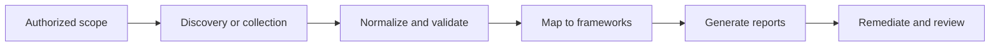

# Security Audit and Verification Tools Suite

> A portfolio-ready monorepo of authorized security assessment tools for exposure review, baseline validation, and remediation reporting.

<table>
  <tr>
    <td align="center">
      
      <br/><sub>Authorized scope</sub>
    </td>
    <td align="center">
      
      <br/><sub>Reporting</sub>
    </td>
    <td align="center">
      
      <br/><sub>Correlation pipeline</sub>
    </td>
  </tr>
</table>

## Overview

This repository contains three complementary security tools that turn raw findings into audit-ready output:

1. **RangeCheck** — authorized network exposure assessment with service discovery, fingerprinting, and framework mapping.
2. **ControlTrace** — local baseline assessment with control evidence, NIST mapping, and POA&M reporting.
3. **Tracer** — threat-intelligence style workflow components for ingestion, enrichment, graph loading, and analyst-facing query APIs.

The goal is not to look like a toy scanner. The goal is to present a complete security workflow: scope, collect, enrich, correlate, and report.

## Visual workflow



## What each project does

| Project | Purpose | Output |
|---|---|---|
| RangeCheck | Safe network exposure review | HTML, JSON, CSV reports |
| ControlTrace | Local baseline and control assessment | HTML, JSON, CSV, POA&M |
| Tracer | Threat data pipeline and correlation layer | API, graph, SIEM enrichment |

## Project highlights

### RangeCheck

- Concurrent TCP service discovery
- Lightweight banner and header fingerprinting
- YAML-driven finding classification
- CVSS metadata and framework mapping
- HTML, JSON, and CSV reporting

### ControlTrace

- DISA STIG-style local checks
- Evidence collection and control tracing
- NIST SP 800-53 and MITRE ATT&CK mapping
- POA&M-oriented remediation reporting
- Audit-friendly export formats

### Tracer

- Kafka ingestion and normalization
- Elasticsearch enrichment and search
- Neo4j graph loading for relationship analysis
- Flask API for indicator and graph queries
- Wazuh/SIEM alert enrichment flow

## Repository layout

```txt
.
├── RangeCheck/
├── controltrace/
├── tracer/
├── complete_missing_files.py
└── README.md
```

## Why this stands out in a portfolio

- It shows end-to-end security engineering, not just a single script.
- It separates safe discovery, compliance mapping, and intel correlation into different tools.
- It uses real reporting artifacts that hiring managers can inspect.
- It communicates maturity: authorization, validation, traceability, and remediation.

## Safety and scope

These tools are built for authorized environments only.

- No exploitation
- No credential attacks
- No evasion or persistence
- No destructive testing

## Quick start

Open the project you want to work on and follow its local README:

- `RangeCheck/README.md`
- `controltrace/README.md`
- `tracer/README.md`

## Public references

- NIST SP 800-53
- NIST SP 800-115
- NIST SP 800-30
- NIST SP 800-37
- DISA STIG Library
- MITRE ATT&CK
- FIRST CVSS v3.1
- CWE
